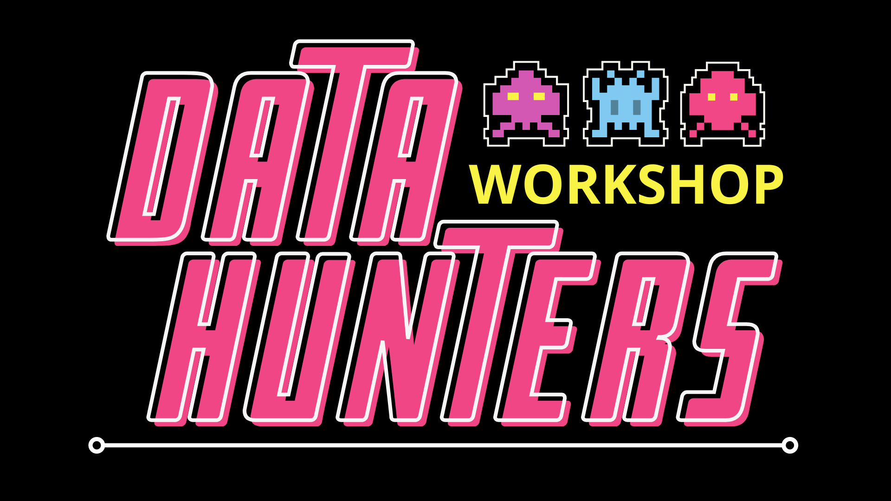

# Source code for the Data Hunters Workshop 

</img>

This online resource was provided to participants of the Data Hunters workshop as a guide to learn the fundamentals of Python, essential for overcoming the challenges presented in the workshop. By acquiring theoretical knowledge and applying it through exercises, participants were able to practice in preparation for the workshop activities.

This resource draws inspiration from [Ruslan Klymentiev](https://github.com/rklymentiev/py-for-neuro) and from the template of [website template](https://github.com/ines/course-starter-python).

## Contact
* Name: Sara Fumagalli
* email: sara.fumagalli@unimib.it
