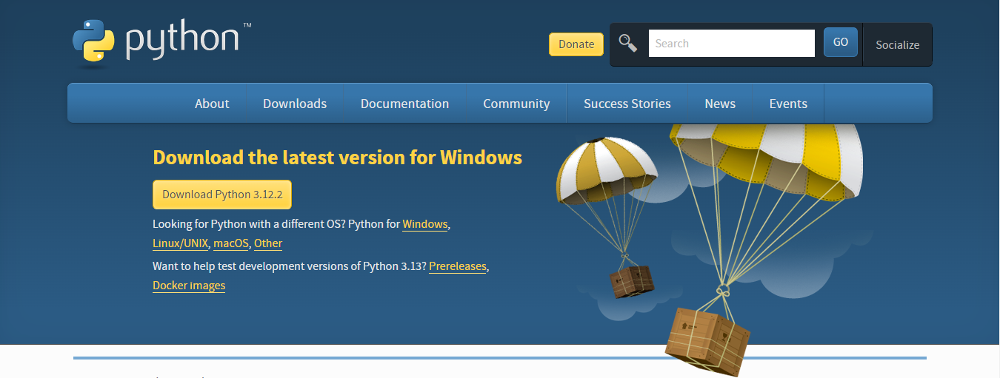
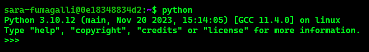
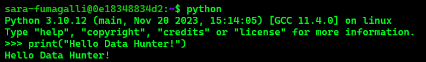

<exercise id="1" title="Introduction">

Ciao Data Hunter!

Qui puoi trovare tutte le informazioni necessarie per affrontare le sfide del workshop, oltre a una vasta gamma di altri dettagli e risorse.

Ma partiamo dal principio...

</img>

JK Python non c'entra nulla, siamo solo fan dei dinosauri

</exercise>

<exercise id="2" title="Python download">

Se vuoi installare Python sul tuo computer, vai sul [sito ufficiale di Python](https://www.python.org/downloads/) nella sezione "Download" e scarica l'ultima versione facendo attenzione a selezionare correttamente il tuo sistema operativo. 

</img>

Una volta scaricato l'installer, avvialo e procedi con l'installazione.
Sì esatto, è proprio così semplice!

⚠️ Attenzione: per partecipare al workshop, **non è necessario** scaricare Python sul proprio computer!

</exercise>

<exercise id="3" title="Python launch">

Per attivare Python, apri il terminale e lancia il comando `python`.
Se l'installazione di Python è stata eseguita con successo, dovresti visualizzare qualcosa simile a questo:

</img>

A questo punto, puoi lanciare tutti i comandi che vuoi. Tipo:

</img>

</exercise>

<exercise id="5" title="Python exit">

Okay, hai completato tutte le tue attività in Python e ora vuoi uscire. 
Per uscire da Python, puoi usare diversi comandi: 
* `exit()`
* `quit()`
* ctrl+D

<exercise id="7" title="Acknowledgments">

* Thanks to [Natasha](https://twitter.com/_apfeltasha) for creating an amazing logo for the website.
* Thanks to [Ines Montani](https://twitter.com/_inesmontani) for providing the [website template](https://github.com/ines/course-starter-python) for the course.
* Thanks to researchers who are making their data and articles publicly available.
* Thanks to everyone who is making the knowledge freely accessible.
* And thank you for participating in the course.

</exercise>
